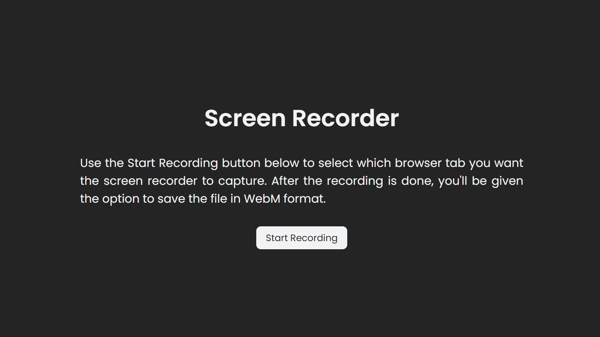
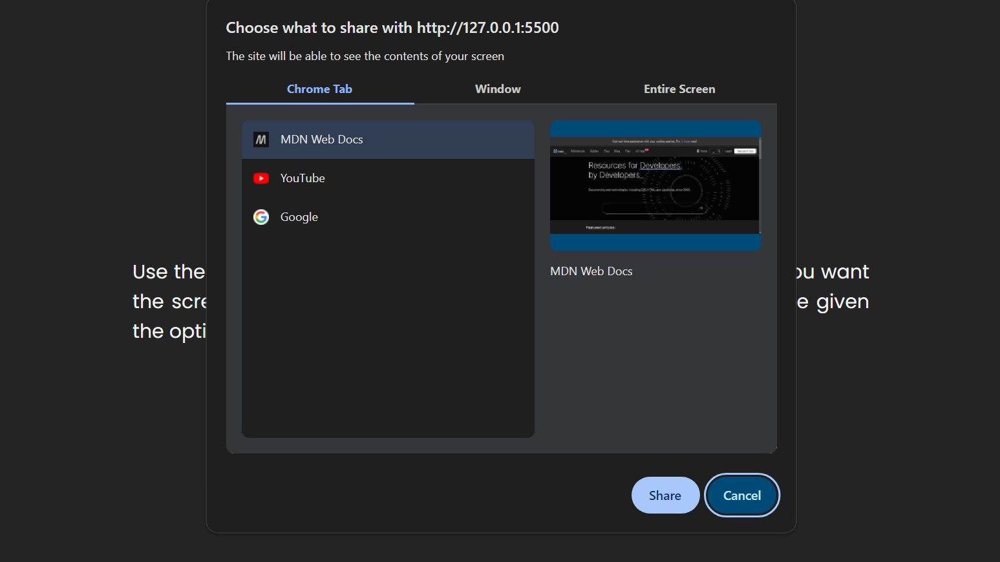
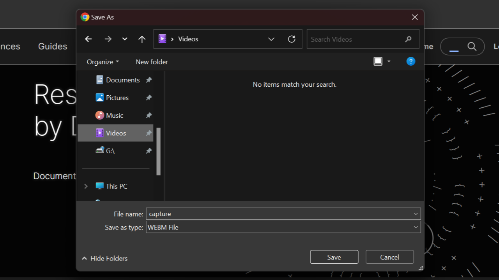

# **JSRecorder: Simple JavaScript Screen Recorder**



Screen Recorder built using HTML, CSS, and JavaScript.

## Table of Contents

- [Summary](#summary)
- [Usage](#usage)
<!-- - [Installation](#installation) -->
- [Screenshots](#screenshots)
- [Credits](#credits)

## Summary

A simple screen recorder built using the Screen Capture API that allows users to capture their screen activity as a video file and provides users with that file in WebM format immediately upon ending the recording which they can save to their local device.

## Usage

To record your screen:

1. Navigate to the live demo

2. Click the `Start Recording` button

3. Select which browser tab you wish to capture

4. Select the `Share` option

5. Save the recording on your local machine after you stop the recording

<!-- ## Installation

1. Clone this repository to your local machine:

   ```bash
    git clone https://github.com/khamisilawrence/*.git
   ```

2. Navigate to repository:

   ```bash
    cd *
   ``` -->

## Screenshots

**Select browser tab to capture**


**Save recording file**


## Credits

- This project was inspired by a [CodePen demo](https://codepen.io/impressivewebs/pen/oNVbwdO) by [Louis Lazaris](https://codepen.io/impressivewebs).
- The API used in the project is the [Screen Capture API](https://developer.mozilla.org/en-US/docs/Web/API/Screen_Capture_API).
